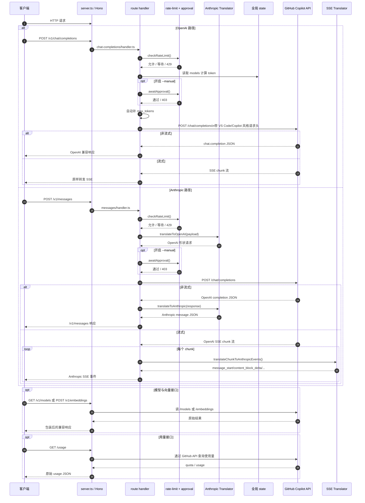

```mermaid
sequenceDiagram
    autonumber
    participant Client as 客户端
    participant Server as server.ts / Hono
    participant Route as route handler
    participant Guard as rate-limit + approval
    participant Xlate as Anthropic Translator
    participant State as 全局 state
    participant Copilot as GitHub Copilot API
    participant Stream as SSE Translator

    Client->>Server: HTTP 请求

    alt OpenAI 路径
        Client->>Server: POST /v1/chat/completions
        Server->>Route: chat-completions/handler.ts
        Route->>Guard: checkRateLimit()
        Guard-->>Route: 允许 / 等待 / 429
        Route->>State: 读取 models 计算 token
        opt 开启 --manual
            Route->>Guard: awaitApproval()
            Guard-->>Route: 通过 / 403
        end
        Route->>Route: 自动补 max_tokens
        Route->>Copilot: POST /chat/completions\n带 VS Code/Copilot 风格请求头
        alt 非流式
            Copilot-->>Route: chat.completion JSON
            Route-->>Client: OpenAI 兼容响应
        else 流式
            Copilot-->>Route: SSE chunk 流
            Route-->>Client: 原样转发 SSE
        end
    else Anthropic 路径
        Client->>Server: POST /v1/messages
        Server->>Route: messages/handler.ts
        Route->>Guard: checkRateLimit()
        Guard-->>Route: 允许 / 等待 / 429
        Route->>Xlate: translateToOpenAI(payload)
        Xlate-->>Route: OpenAI 形状请求
        opt 开启 --manual
            Route->>Guard: awaitApproval()
            Guard-->>Route: 通过 / 403
        end
        Route->>Copilot: POST /chat/completions
        alt 非流式
            Copilot-->>Route: OpenAI completion JSON
            Route->>Xlate: translateToAnthropic(response)
            Xlate-->>Route: Anthropic message JSON
            Route-->>Client: /v1/messages 响应
        else 流式
            Copilot-->>Route: OpenAI SSE chunk 流
            loop 每个 chunk
                Route->>Stream: translateChunkToAnthropicEvents()
                Stream-->>Route: message_start/content_block_delta/... 
                Route-->>Client: Anthropic SSE 事件
            end
        end
    end

    opt 模型与向量接口
        Client->>Server: GET /v1/models 或 POST /v1/embeddings
        Server->>Copilot: 调 /models 或 /embeddings
        Copilot-->>Server: 原始结果
        Server-->>Client: 包装后的兼容响应
    end

    opt 用量接口
        Client->>Server: GET /usage
        Server->>Copilot: 通过 GitHub API 查询使用量
        Copilot-->>Server: quota / usage
        Server-->>Client: 原始 usage JSON
    end
```
