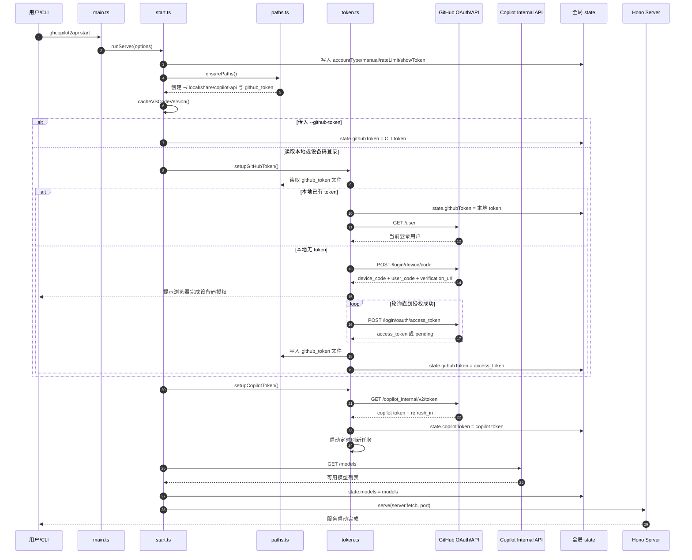

```mermaid
sequenceDiagram
    autonumber
    participant U as 用户/CLI
    participant M as main.ts
    participant S as start.ts
    participant P as paths.ts
    participant T as token.ts
    participant GH as GitHub OAuth/API
    participant C as Copilot Internal API
    participant ST as 全局 state
    participant H as Hono Server

    U->>M: ghcopilot2api start
    M->>S: runServer(options)
    S->>ST: 写入 accountType/manual/rateLimit/showToken
    S->>P: ensurePaths()
    P-->>S: 创建 ~/.local/share/copilot-api 与 github_token
    S->>S: cacheVSCodeVersion()

    alt 传入 --github-token
        S->>ST: state.githubToken = CLI token
    else 读取本地或设备码登录
        S->>T: setupGitHubToken()
        T->>P: 读取 github_token 文件
        alt 本地已有 token
            T->>ST: state.githubToken = 本地 token
            T->>GH: GET /user
            GH-->>T: 当前登录用户
        else 本地无 token
            T->>GH: POST /login/device/code
            GH-->>T: device_code + user_code + verification_uri
            T-->>U: 提示浏览器完成设备码授权
            loop 轮询直到授权成功
                T->>GH: POST /login/oauth/access_token
                GH-->>T: access_token 或 pending
            end
            T->>P: 写入 github_token 文件
            T->>ST: state.githubToken = access_token
        end
    end

    S->>T: setupCopilotToken()
    T->>GH: GET /copilot_internal/v2/token
    GH-->>T: copilot token + refresh_in
    T->>ST: state.copilotToken = copilot token
    T->>T: 启动定时刷新任务

    S->>C: GET /models
    C-->>S: 可用模型列表
    S->>ST: state.models = models
    S->>H: serve(server.fetch, port)
    H-->>U: 服务启动完成
```